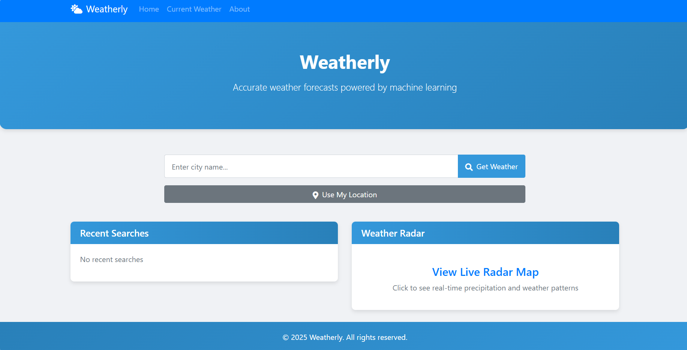
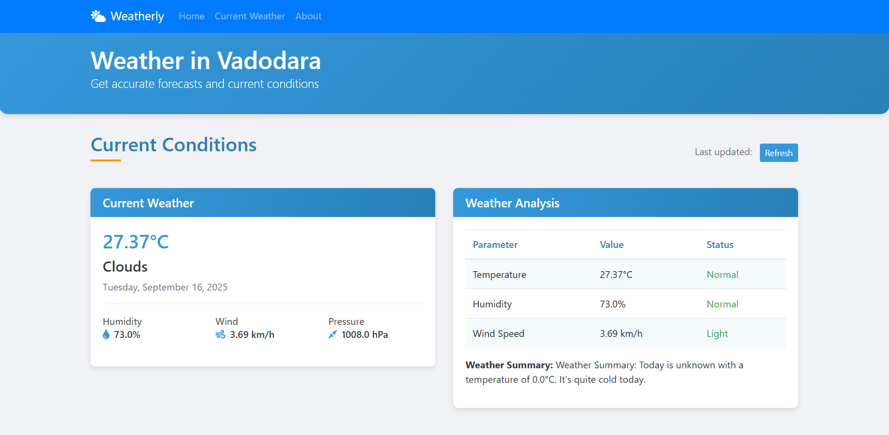
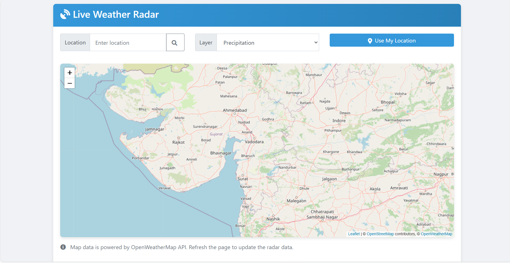

# 🌤️ Weatherly  

A dynamic web application that fetches and displays **live weather information** using external API integration. With **Weatherly**, users can search for any city worldwide and instantly view **real-time weather details**, including:  
- 🌡️ Temperature  
- 💧 Humidity  
- 🌬️ Wind speed  
- ☁️ Overall weather conditions
- 📆 5-Day Forecast using ML-based prediction
- ⏰ Hourly Forecast Trends
- 📊 Weather Charts & Graphs (temperature, humidity, wind speed trends)
- 🌓 Dark/Light Theme Toggle
- 📍 Auto Location Detection for instant weather updates


---

## 🚀 Features  

- 🔎 **City Search** – Get live weather details for any location.  
- ⏱️ **Real-Time Data** – Fetched directly from an external weather API.  
- 📊 **Detailed Weather Info** – Temperature, humidity, wind speed, and conditions.  
- 🎨 **Responsive UI** – Optimized for both desktop and mobile.  
- ⚡ **Fast & Lightweight** – Built with modern web technologies.  

---

## 🛠️ Tech Stack  

- **Frontend:** JSP, HTML5, CSS3, JavaScript, Bootstrap  
- **Backend:** Java Servlets  
- **API Integration:** OpenWeatherMap (or similar weather API)  
- **Build Tool/IDE:** NetBeans / Apache Tomcat  

---

## ⚙️ Installation & Setup  

1. Clone this repository:  
   ```bash
   git clone https://github.com/RohitManvar/Weatherly.git

2. Open the project in NetBeans (or your preferred IDE).

3. Configure your API key in the servlet (from OpenWeatherMap):
  private static final String API_KEY = "YOUR_API_KEY";

4. Deploy the project on Apache Tomcat server.

5. Open in your browser:
  http://localhost:8080/Weatherly

### 🎯 Usage
Enter a city name in the search bar.
Click Search.
Instantly view real-time weather data.

### 🌱 Future Enhancements

🔔 Weather Alerts (extreme heat, rain, storms, etc.)

📱 Mobile App Version for Android/iOS

## 📸 Screenshots

### 🏠 Index Page  
Search for any city and get live weather updates.  
  

---

### 🌤️ Current Weather Page  
Displays real-time weather details including temperature, humidity, wind speed, and condition icons.  
  

---

### 📆 Forecast Page  
5-day or hourly forecast trends with charts and ML-based predictions.  
  

---

### 🛰️ Radar Page  
Interactive weather radar visualization with live updates.  
  


